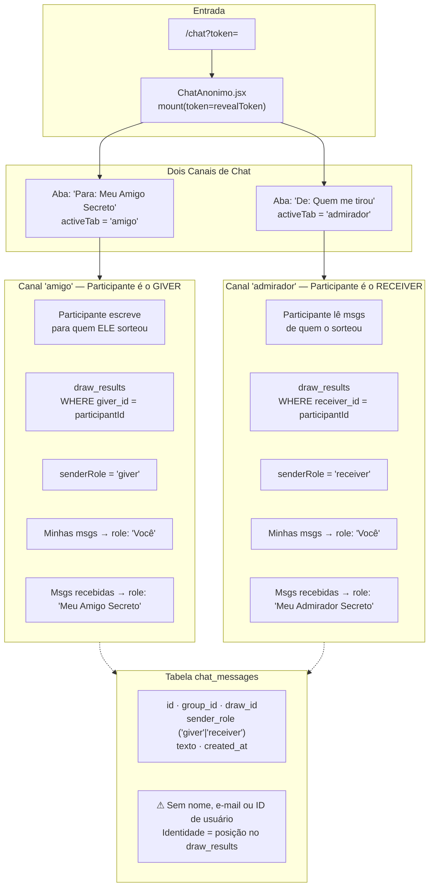
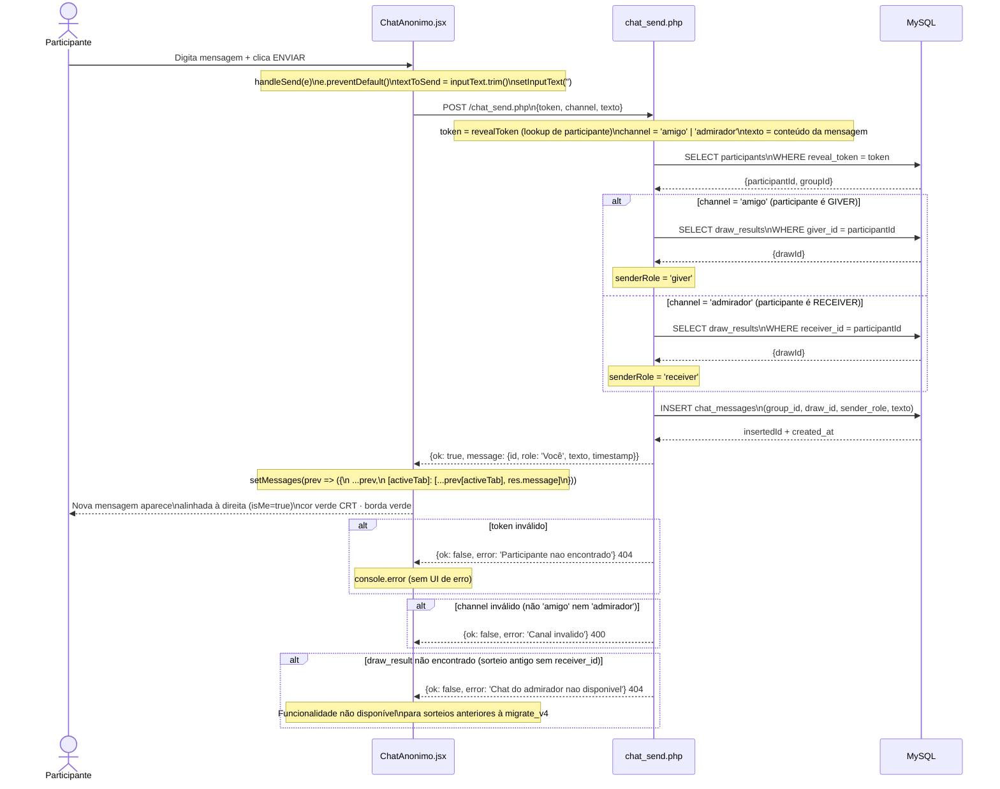
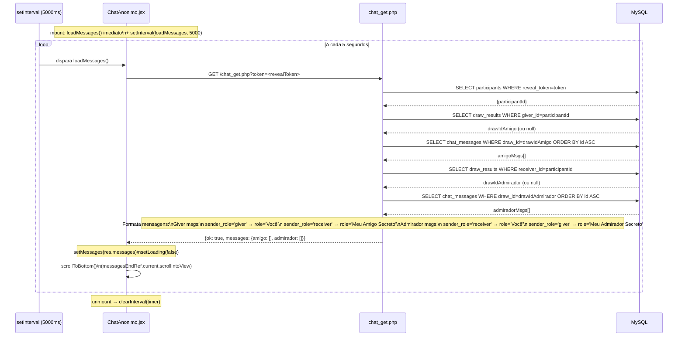
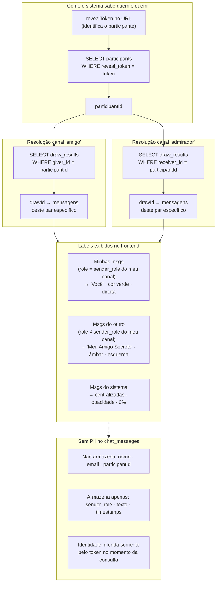

# Módulo: Chat Anônimo (SA-04 · A Sombra)

> **Achado crítico de redesign:** O chat possui **dois canais independentes** por participante,
> não um único. A identidade é mascarada exclusivamente pelo campo `sender_role` na tabela
> `chat_messages` — nenhum PII é armazenado no chat. Ao redesenhar a UI, preservar a
> separação visual de abas e o label dinâmico ('Você' vs 'Meu Amigo Secreto').

> **Tecnologia:** Polling puro a cada 5 segundos via `setInterval`. Não há WebSocket nem SSE.

---

## Diagrama 1 — Arquitetura de Dois Canais



---

## Diagrama 2 — Fluxo de Envio de Mensagem



---

## Diagrama 3 — Polling e Exibição de Mensagens



---

## Diagrama 4 — Lógica de Mascaramento de Identidade



---

## Regras de Negócio Preservar no Redesign

| Regra | Origem no código | Criticidade |
|---|---|---|
| Dois canais separados por aba | `activeTab` state + dois arrays em `messages` | **Alta** — lógica central |
| Label 'Você' para mensagens próprias | `msg.role === 'Você'` → `isMe = true` | **Alta** — identidade mascarada |
| Sistema como primeira mensagem | Injetado em `chat_get.php` formatação | **Média** — UX de contexto |
| Polling 5 segundos | `setInterval(loadMessages, 5000)` | **Média** — sem WebSocket |
| Scroll automático ao fundo | `scrollToBottom()` após `setMessages` | **Baixa** — UX |
| Botão voltar para revelação | `window.location.href = /reveal?token=` | **Média** — navegação |
| Entrada desabilitada se texto vazio | `disabled={!inputText.trim()}` | **Baixa** — UX |

---

## 🔄 Ação Requerida — Obsidian Mirror

```
╔══════════════════════════════════════════════════════╗
║  ⚑  AÇÃO REQUERIDA · MIRROR OBSIDIAN                ║
╠══════════════════════════════════════════════════════╣
║  Módulo: chat_anonimo                                ║
║  Arquivo: docs/modules/chat_anonimo.md               ║
║  Draw.io: docs/arquitetura.drawio (swimlane SA-04)   ║
║                                                      ║
║  Após qualquer alteração em:                         ║
║  ChatAnonimo.jsx · chat_get.php · chat_send.php      ║
║  Tabelas: chat_messages · draw_results               ║
║                                                      ║
║  1. Atualizar swimlane SA-04 no drawio               ║
║  2. Refletir mudança neste arquivo Mermaid           ║
║  3. Copiar bloco Mermaid atualizado para o vault     ║
║  4. Exportar PNG do drawio para vault                ║
╚══════════════════════════════════════════════════════╝
```
