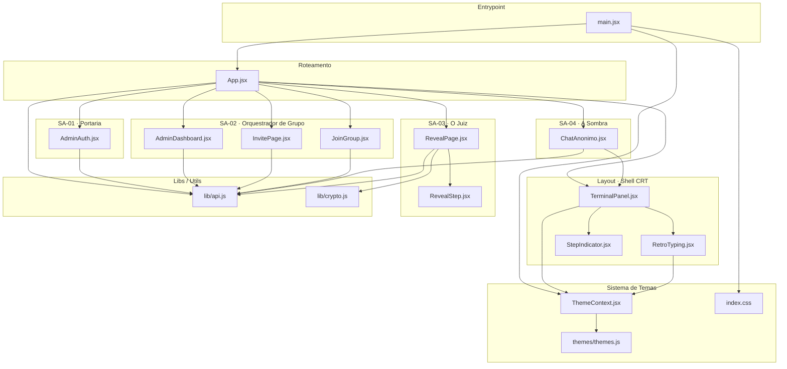

# Módulo: Mapa de Dependências React

> **Contexto de uso:** Inclua este arquivo em prompts sobre impacto transversal de mudanças,
> refatorações em arquivos centrais (`api.js`, `ThemeContext.jsx`) ou criação de novos componentes.
> Não inclua junto a módulos funcionais específicos — use um ou outro por prompt.

---

## Diagrama — Grafo de Dependências por Sub-agente



---

## Tabela de Impacto por Arquivo

Ordena arquivos pelo número de dependentes diretos e indiretos — quanto maior, maior o risco
de alterar.

| Arquivo | Dependentes diretos | Impacto | Observação |
|---|---|---|---|
| `lib/api.js` | 7 (App + todos os SA) | **CRÍTICO** | Toca tudo — qualquer mudança exige teste em todas as rotas |
| `ThemeContext.jsx` | 3 (main, TerminalPanel, RetroTyping) | **ALTO** | Afeta toda a UI visual |
| `TerminalPanel.jsx` | 2 (App, ChatAnonimo) | **MÉDIO-ALTO** | Layout shell de quase todas as telas |
| `RetroTyping.jsx` | 1 (TerminalPanel) | **MÉDIO** | Via TerminalPanel, afeta indiretamente tudo |
| `lib/crypto.js` | 1 (RevealPage) | **MÉDIO** | Impacto isolado mas crítico — segurança |
| `themes/themes.js` | 1 (ThemeContext) | **BAIXO** | Mudança de dados sem lógica |
| `RevealStep.jsx` | 1 (RevealPage) | **BAIXO** | Componente folha de apresentação |
| `StepIndicator.jsx` | 1 (TerminalPanel) | **BAIXO** | Componente folha |

---

## Componentes Folha (sem dependências)

Arquivos que não importam nenhum outro módulo do projeto. Seguros para alterar de forma isolada.

```
lib/api.js          ← folha de chamadas externas (fetch)
lib/crypto.js       ← folha de criptografia (Web Crypto API nativa)
themes/themes.js    ← folha de dados (objeto de configuração)
index.css           ← folha de estilos globais
RevealStep.jsx      ← folha de apresentação
StepIndicator.jsx   ← folha de apresentação
```

---

## Clusters de Mudança Segura

Agrupa componentes que podem ser alterados juntos sem risco de efeito colateral entre clusters.

| Cluster | Arquivos | Pode alterar sem afetar outro cluster? |
|---|---|---|
| A — Auth Admin | `AdminAuth.jsx` | Sim |
| B — Grupo | `AdminDashboard.jsx`, `InvitePage.jsx`, `JoinGroup.jsx` | Sim |
| C — Reveal | `RevealPage.jsx`, `RevealStep.jsx`, `crypto.js` | Sim |
| D — Chat | `ChatAnonimo.jsx` | Sim (usa TerminalPanel mas não o modifica) |
| E — Shell | `TerminalPanel.jsx`, `RetroTyping.jsx`, `StepIndicator.jsx` | **Não** — afeta A, B, C, D via App |
| F — Tema | `ThemeContext.jsx`, `themes.js` | **Não** — afeta E que afeta tudo |
| G — API | `api.js` | **Não** — afeta todos os clusters |
