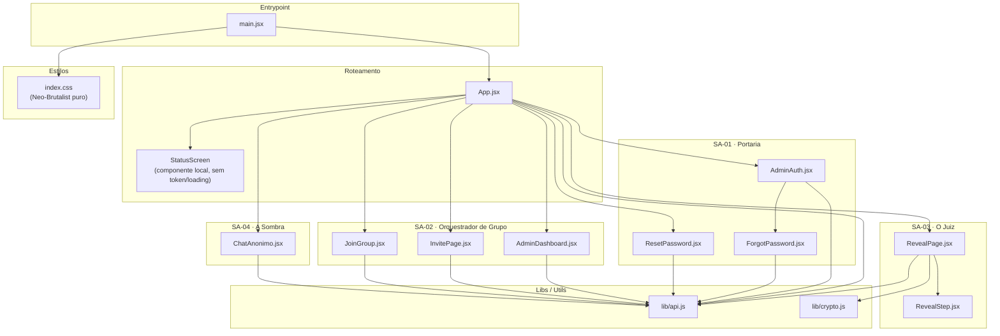

# Módulo: Mapa de Dependências React

> **Contexto de uso:** Inclua este arquivo em prompts sobre impacto transversal de mudanças,
> refatorações em arquivos centrais (`api.js`, `index.css`) ou criação de novos componentes.
> Não inclua junto a módulos funcionais específicos — use um ou outro por prompt.

---

## Diagrama — Grafo de Dependências por Sub-agente



---

## Tabela de Impacto por Arquivo

Ordena arquivos pelo número de dependentes diretos e indiretos — quanto maior, maior o risco
de alterar.

| Arquivo | Dependentes diretos | Impacto | Observação |
|---|---|---|---|
| `lib/api.js` | 9 (App + todos os SA + recuperação de senha) | **CRÍTICO** | Toca tudo — qualquer mudança exige teste em todas as rotas |
| `lib/crypto.js` | 1 (RevealPage) | **MÉDIO** | Impacto isolado mas crítico — segurança |
| `RevealStep.jsx` | 1 (RevealPage) | **BAIXO** | Componente folha de apresentação |

---

## Componentes Folha (sem dependências)

Arquivos que não importam nenhum outro módulo do projeto. Seguros para alterar de forma isolada.

```
lib/api.js          ← folha de chamadas externas (fetch)
lib/crypto.js       ← folha de criptografia (Web Crypto API nativa)
index.css           ← folha de estilos globais (100% Neo-Brutalist)
RevealStep.jsx      ← folha de apresentação
```

---

## Clusters de Mudança Segura

Agrupa componentes que podem ser alterados juntos sem risco de efeito colateral entre clusters.
Não há mais cluster de "Shell CRT" ou "Tema" — ambos foram removidos do projeto em 2026-06-29
(ver `update_note` do frontmatter).

| Cluster | Arquivos | Pode alterar sem afetar outro cluster? |
|---|---|---|
| A — Auth Admin | `AdminAuth.jsx`, `ForgotPassword.jsx`, `ResetPassword.jsx` | Sim |
| B — Grupo | `AdminDashboard.jsx`, `InvitePage.jsx`, `JoinGroup.jsx` | Sim |
| C — Reveal | `RevealPage.jsx`, `RevealStep.jsx`, `crypto.js` | Sim |
| D — Chat | `ChatAnonimo.jsx` | Sim (layout próprio Neo-Brutalist) |
| E — API | `api.js` | **Não** — afeta todos os clusters |
