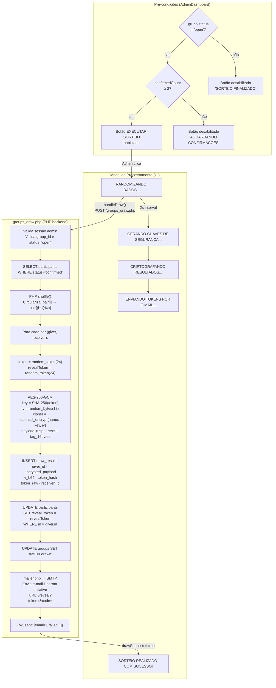
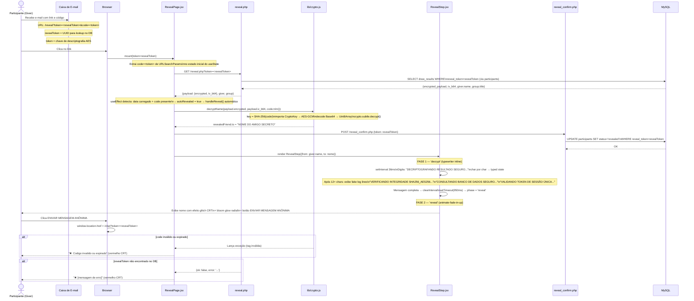
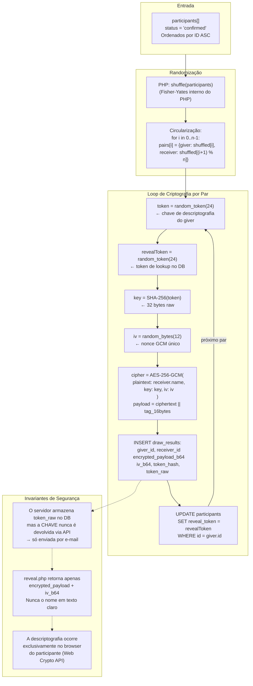
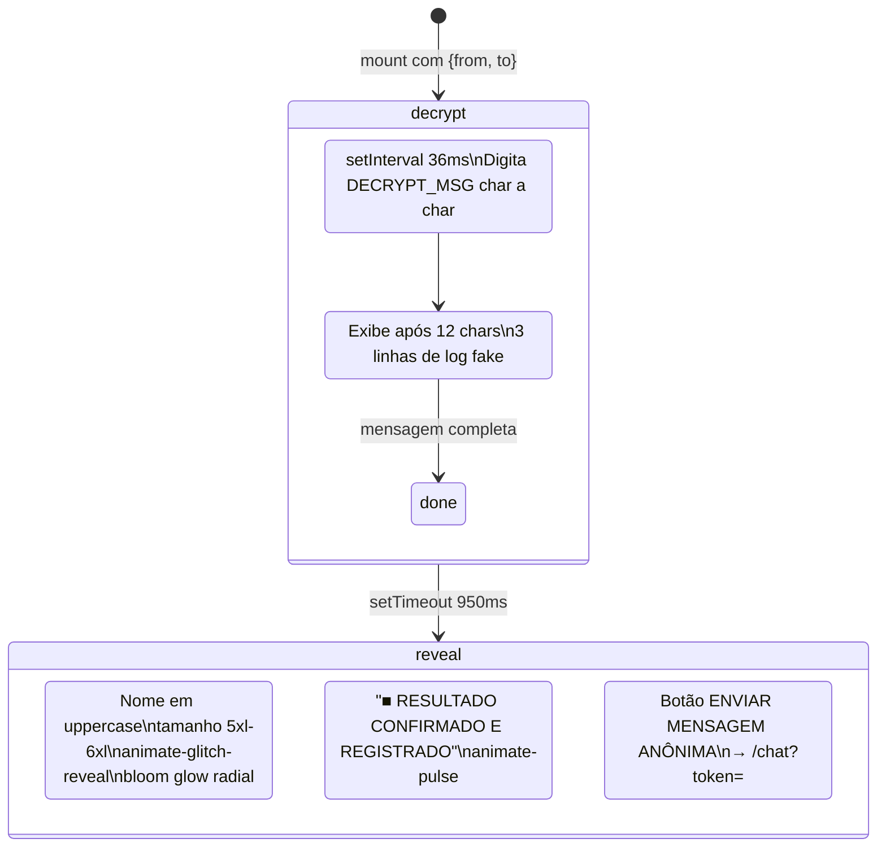

# Módulo: O Juiz — Sorteio e Revelação (SA-03)

> **Achado crítico de redesign:** `RevealStep.jsx` possui seu próprio efeito typewriter
> implementado com `setInterval` inline — **não usa `RetroTyping.jsx`**. O `RetroTyping.jsx`
> pertence ao `TerminalPanel.jsx`. Ao redesenhar, manter os dois comportamentos separados.

> **Achado de segurança:** O link de revelação embute a chave de descriptografia diretamente
> na URL (`?code=<token>`). O backend nunca recebe essa chave — ela existe apenas no e-mail
> do participante e no browser no momento da revelação. Nunca alterar esse contrato.

---

## Diagrama 1 — Gatilho e Execução do Sorteio



---

## Diagrama 2 — Fluxo Completo de Revelação



---

## Diagrama 3 — Algoritmo de Sorteio (backend PHP)



---

## Componente RevealStep — Fases de Animação



---

## 🔄 Ação Requerida — Obsidian Mirror

```
╔══════════════════════════════════════════════════════╗
║  ⚑  AÇÃO REQUERIDA · MIRROR OBSIDIAN                ║
╠══════════════════════════════════════════════════════╣
║  Módulo: juiz_sorteio                                ║
║  Arquivo: docs/modules/juiz_sorteio.md               ║
║  Draw.io: docs/arquitetura.drawio (swimlane SA-03)   ║
║                                                      ║
║  Após qualquer alteração em:                         ║
║  groups_draw.php · reveal.php · reveal_confirm.php   ║
║  RevealPage.jsx · RevealStep.jsx · crypto.js         ║
║                                                      ║
║  ⚠ INVOCAR /007 antes de alterar crypto.js           ║
║     ou qualquer endpoint deste módulo                ║
║                                                      ║
║  1. Atualizar swimlane SA-03 no drawio               ║
║  2. Refletir mudança neste arquivo Mermaid           ║
║  3. Copiar bloco Mermaid atualizado para o vault     ║
║  4. Exportar PNG do drawio para vault                ║
╚══════════════════════════════════════════════════════╝
```
