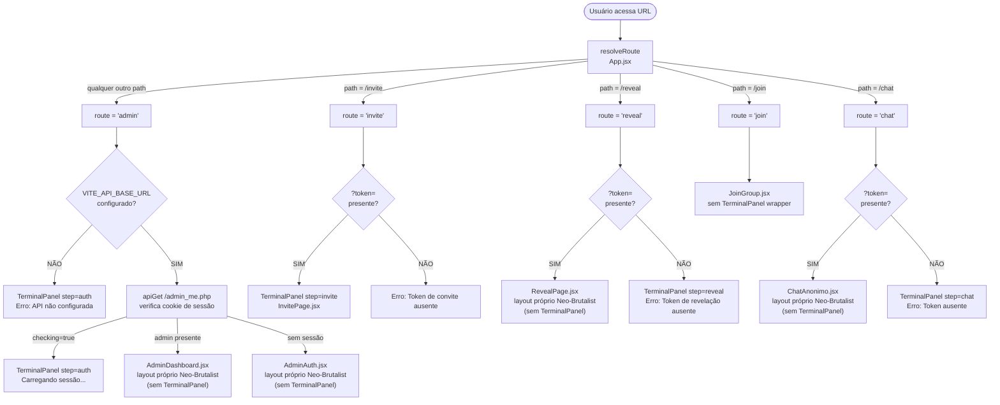
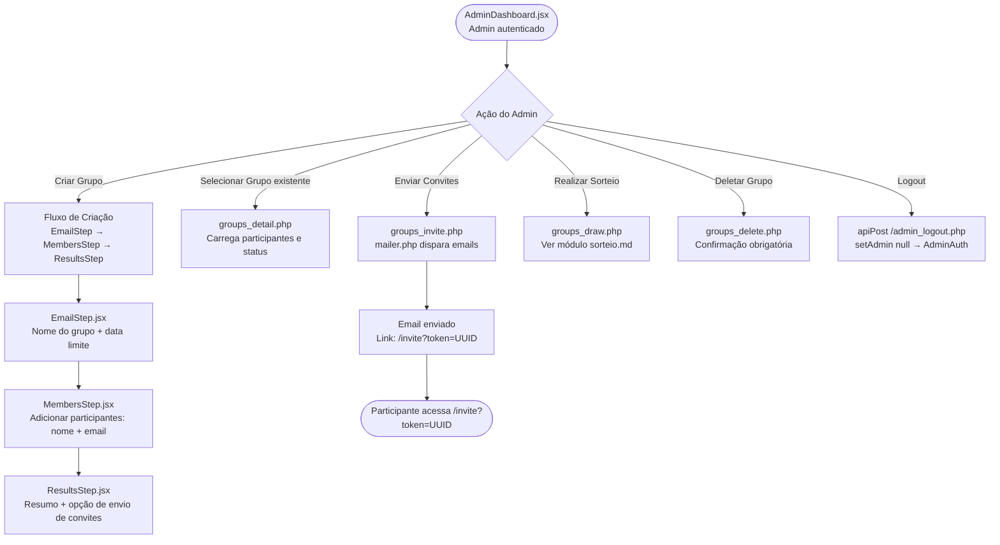
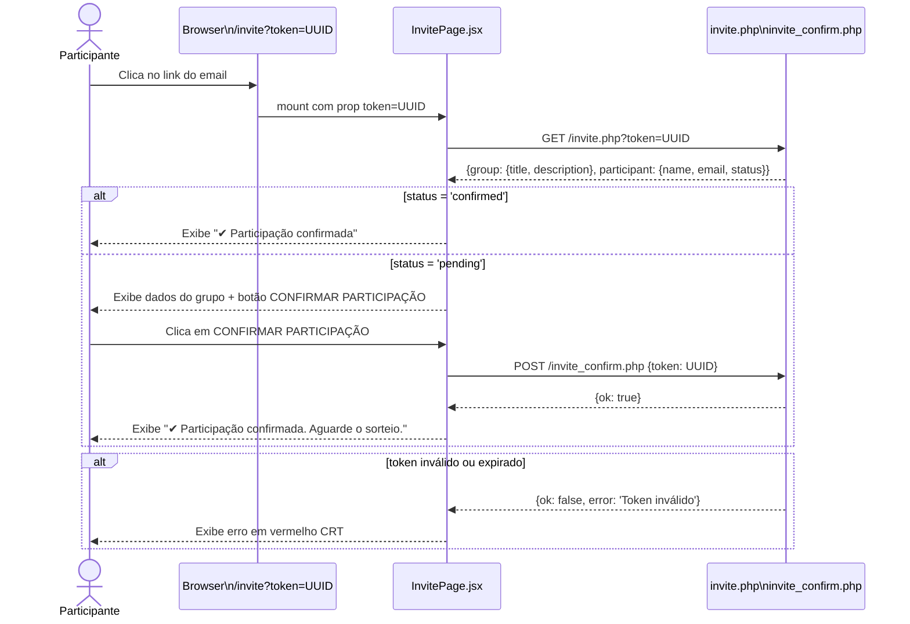
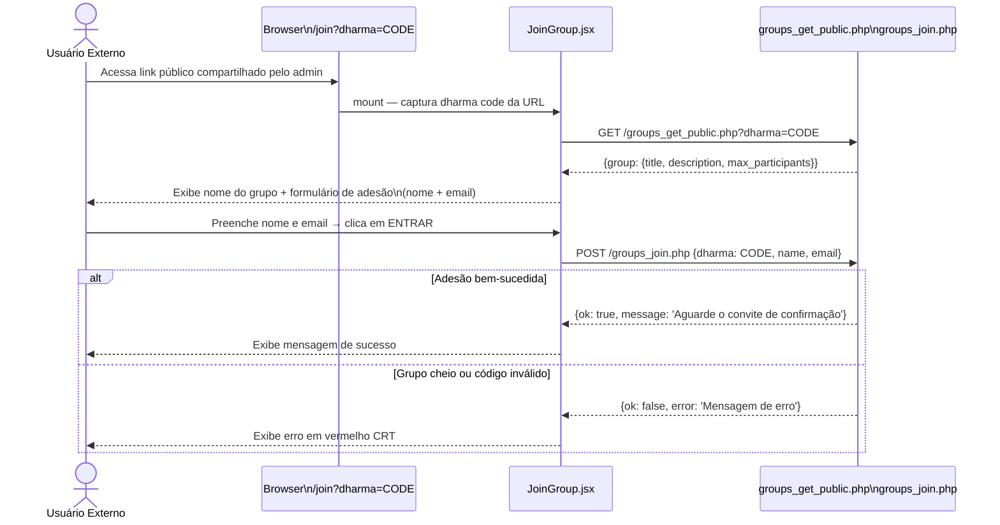

# Módulo: Menu Inicial — Fluxo de Entrada e Self-Invitation

> **Contexto de uso:** Inclua este arquivo em prompts sobre o ponto de entrada da aplicação,
> fluxo de autenticação admin, CTAs do TerminalPanel, e fluxo de convite/adesão de participante.

---

## Diagrama 1 — Roteamento e Entry Point (App.jsx)

---

## Diagrama 2 — CTA Flow no TerminalPanel / AdminDashboard

---

## Diagrama 3 — Fluxo de Self-Invitation (InvitePage.jsx)

---

## Diagrama 4 — Fluxo de Adesão Pública (JoinGroup.jsx · Dharma Code)

---

## Uso do TerminalPanel por Rota (pós-redesign Neo-Brutalist)

> **2026-06-28:** AdminAuth, AdminDashboard, RevealPage e ChatAnonimo passaram a ter
> layout próprio. TerminalPanel é usado apenas para estados de erro/loading.

| Situação | `step` | Usa TerminalPanel? | Componente principal |
|---|---|---|---|
| API não configurada | `"auth"` | ✅ sim | — (só exibe erro) |
| Verificando sessão (loading) | `"auth"` | ✅ sim | — (só exibe loading) |
| Admin autenticado | — | ❌ não | AdminDashboard.jsx (full-page) |
| Sem sessão admin | — | ❌ não | AdminAuth.jsx (full-page) |
| `/invite` com token | `"invite"` | ✅ sim | InvitePage.jsx |
| `/invite` sem token | `"invite"` | ✅ sim | — (só exibe erro) |
| `/reveal` com token | — | ❌ não | RevealPage.jsx (full-page) |
| `/reveal` sem token | `"reveal"` | ✅ sim | — (só exibe erro) |
| `/chat` com token | — | ❌ não | ChatAnonimo.jsx (full-page) |
| `/chat` sem token | `"chat"` | ✅ sim | — (só exibe erro) |
| `/join` | — | ❌ não | JoinGroup.jsx (layout próprio) |

---

## Pontos de Extensão (Onde Adicionar Features)

| Feature desejada                         | Ponto de inserção                        |
|------------------------------------------|------------------------------------------|
| Nova rota pública                        | `resolveRoute()` em `App.jsx` + novo componente |
| Novo CTA no dashboard                    | `AdminDashboard.jsx` + novo endpoint PHP |
| Novo campo no formulário de convite      | `InvitePage.jsx` + `invite_confirm.php`  |
| Novo tema visual                         | `src/themes/themes.js` + CSS variables   |
| Página de erro personalizada             | Novo componente + tratamento em `App.jsx`|
