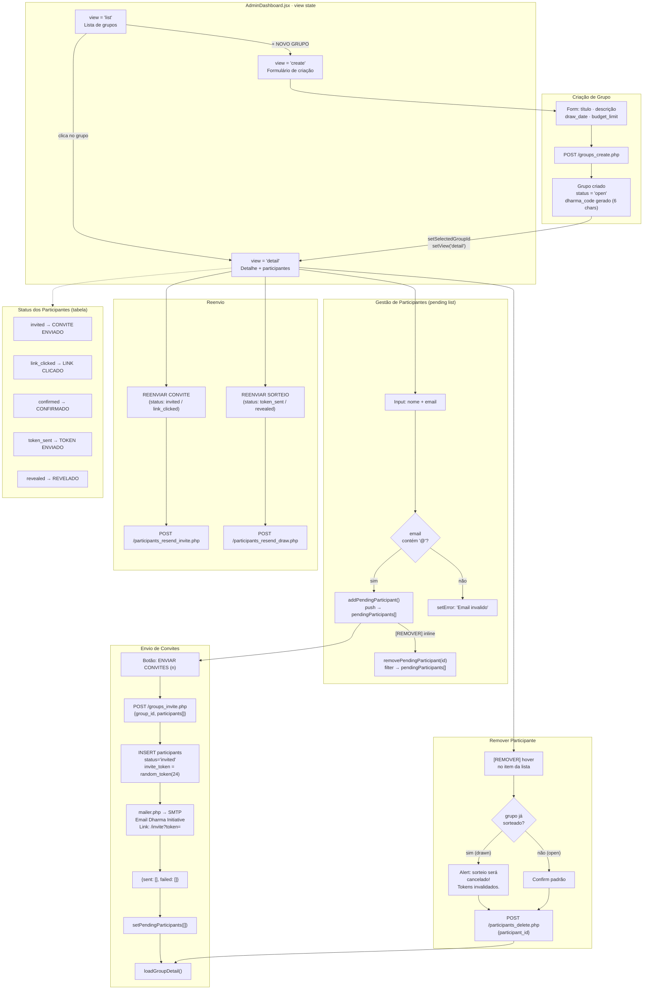
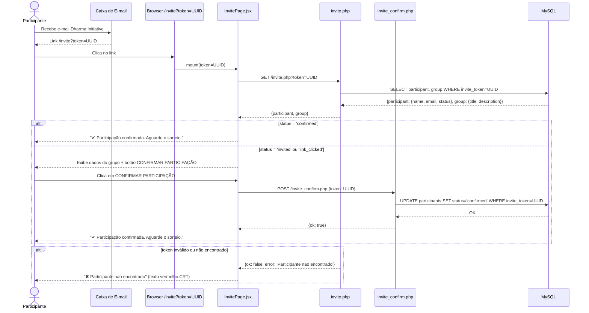
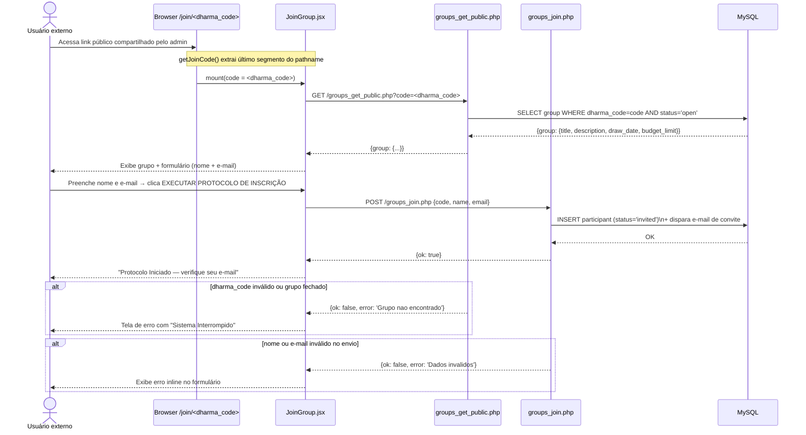
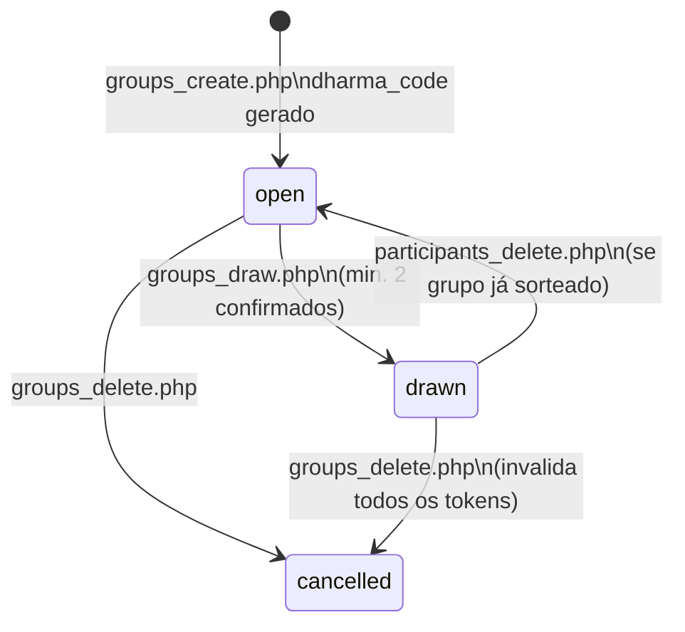

# Módulo: Orquestrador de Grupo (SA-02)

> **Aviso de redesign:** `EmailStep.jsx`, `MembersStep.jsx` e `ResultsStep.jsx` são
> componentes **legados** — não são importados pelo fluxo ativo. O `AdminDashboard.jsx`
> implementa toda a lógica diretamente com formulários inline. Manter os arquivos legados
> durante o redesign; a lógica de negócio vive no backend PHP.

---

## Diagrama 1 — Ciclo de Vida do Grupo e Gestão de Participantes



---

## Diagrama 2 — Fluxo de Confirmação de Convite (InvitePage.jsx)



---

## Diagrama 3 — Auto-Inscrição via Dharma Code (JoinGroup.jsx)



---

## Componentes Legados (manter durante o redesign)

> Estes componentes existem no codebase mas **não estão importados** no fluxo ativo.
> Preservar a lógica de negócio embutida — pode ser reativada ou servir de referência.

| Componente | Lógica preservada | Estado atual |
|---|---|---|
| `EmailStep.jsx` | Input de email do organizador, validação via `onKeyDown` | Não importado |
| `MembersStep.jsx` | Textarea de nomes (1/linha), contagem, validação mín. 2, botão de sorteio | Não importado |
| `ResultsStep.jsx` | Lista de resultados com links copiáveis por participante | Não importado |

**Regra para o redesign:** as regras de negócio (mín. 2 participantes, validação de email,
estado pending antes do envio em lote) devem ser mantidas no novo design.

---

## Estados do Grupo (status field)



---

## 🔄 Ação Requerida — Obsidian Mirror

```
╔══════════════════════════════════════════════════════╗
║  ⚑  AÇÃO REQUERIDA · MIRROR OBSIDIAN                ║
╠══════════════════════════════════════════════════════╣
║  Módulo: orquestrador_grupo                          ║
║  Arquivo: docs/modules/orquestrador_grupo.md         ║
║  Draw.io: docs/arquitetura.drawio (swimlane SA-02)   ║
║                                                      ║
║  Após qualquer alteração em:                         ║
║  AdminDashboard.jsx · groups_*.php · invite*.php     ║
║                                                      ║
║  1. Atualizar swimlane SA-02 no drawio               ║
║  2. Refletir mudança neste arquivo Mermaid           ║
║  3. Copiar bloco Mermaid atualizado para o vault     ║
║  4. Exportar PNG do drawio para vault                ║
╚══════════════════════════════════════════════════════╝
```
