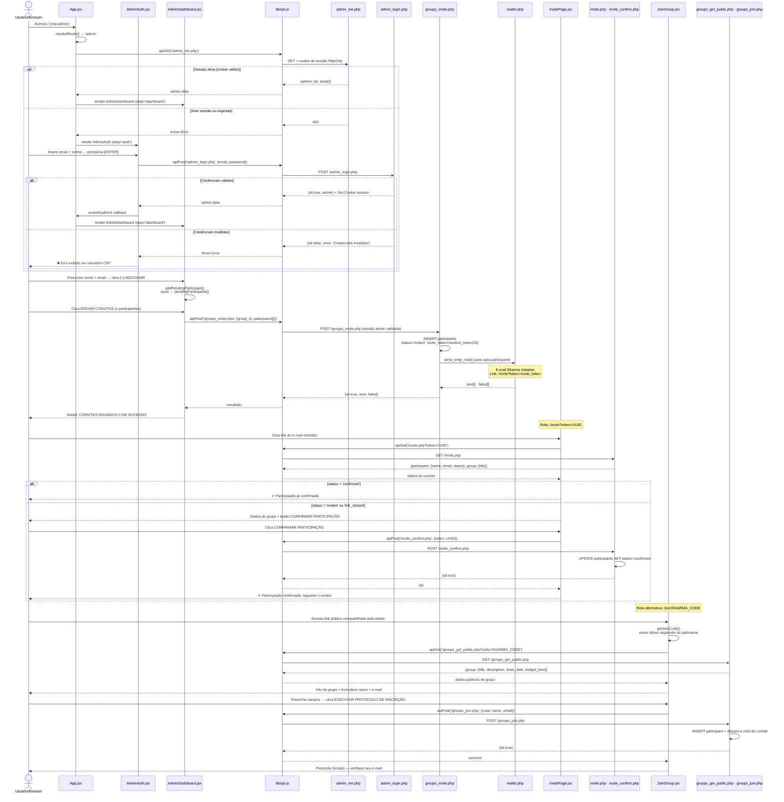
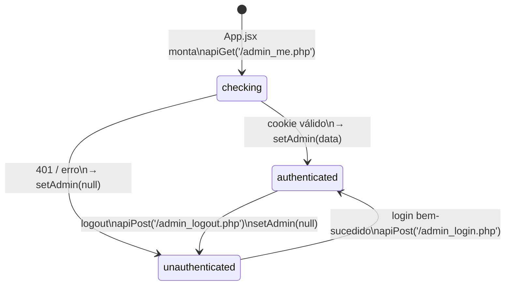

# Módulo: Portaria e Autenticação (SA-01 · A Portaria)

> **Contexto de uso:** Inclua este arquivo em prompts sobre autenticação de admin,
> gestão de sessão (cookie HttpOnly), fluxo de convite e auto-inscrição via Dharma Code.
> Para detalhes internos de grupos e participantes, use `orquestrador_grupo.md`.

---

## Diagrama 1 — Jornada Completa: Auth → Convite → Confirmação → Auto-inscrição



---

## Estados de Sessão Admin



---

## Invariantes de Segurança (SA-01)

| Invariante | Implementação |
|---|---|
| Sessão via cookie HttpOnly | PHP `session_start()` + `Set-Cookie: HttpOnly` |
| `admin_me.php` chamado em todo mount | `useEffect([], [route])` no App.jsx |
| Logout via POST antes de limpar estado | `handleLogout()` chama endpoint antes de `setAdmin(null)` |
| Credenciais nunca em `localStorage` | Apenas cookie de sessão — nenhum token no browser storage |

---

## 🔄 Ação Requerida — Obsidian Mirror

```
╔══════════════════════════════════════════════════════╗
║  ⚑  AÇÃO REQUERIDA · MIRROR OBSIDIAN                ║
╠══════════════════════════════════════════════════════╣
║  Módulo: portaria_auth                               ║
║  Arquivo: docs/modules/portaria_auth.md              ║
║  Draw.io: docs/arquitetura.drawio (swimlane SA-01)   ║
║                                                      ║
║  Após qualquer alteração em:                         ║
║  AdminAuth.jsx · admin_login.php · admin_me.php      ║
║  admin_logout.php · admin_register.php               ║
║                                                      ║
║  1. Atualizar swimlane SA-01 no drawio               ║
║  2. Refletir mudança neste arquivo Mermaid           ║
║  3. Copiar bloco Mermaid atualizado para o vault     ║
║  4. Exportar PNG do drawio para vault                ║
╚══════════════════════════════════════════════════════╝
```
